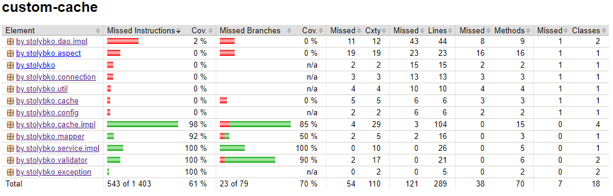
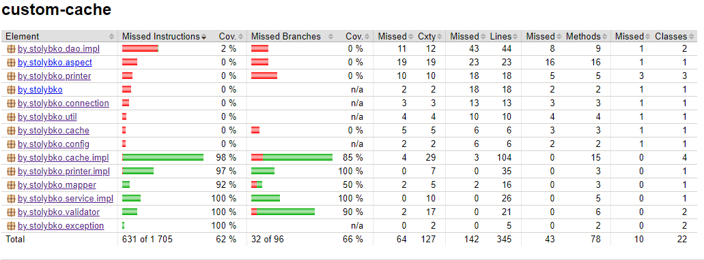

# Task cache
1. Создать любой gradle проект
2. Проект должен быть совместим с java 17
3. Придерживаться GitFlow: master -> develop -> feature/fix
4. Создать реализацию кэша, используя алгоритмы LRU и LFU
5. Создать в приложении слои service и dao (service будет вызывать слой dao, слой dao будет временная замена database). В этих сервисах реализовать CRUD операции для работы с entity. Работу организовать через интерфейсы.
6. Результат работы dao должен синхронизироваться с кешем через proxy (или кастомная аннотация, или АОП/aspectj). При работе с entity оперируем id. Алгоритм работы с кешем:  
GET - ищем в кеше и если там данных нет, то достаем объект из dao, сохраняем в кеш и возвращаем  
POST - сохраняем в dao и потом сохраняем в кеше  
DELETE - удаляем из dao и потом удаляем из кеша  
PUT - обновление/вставка в dao и потом обновление/вставка в кеше
7. Алгоритм и максимальный размер коллекции должны читаться из файла resources/application.yml
8. Создать entity, в нем должно быть поле id и еще минимум 4 поля
9. Service работает с dto
10. Объекты (dto), которые принимает service, должны валидироваться. В т.ч. добавить regex валидацию
11. Кеши должны быть покрыты unit tests
12. Должен содержать javadoc и описанный README.md
13. Использовать lombok
14. Реализовать метод для получения информации в формате xml

Доп. задание:  
*** Самописный JsonParser подтягивать как библиотеку и парсировать json через него  
***В самописный JsonParser добавить возможность работы с xml 
___
Используемый стек
---
В проекте использован следующий стек технологий:
1. Java 17
2. Gradle
3. PostgreSQL
4. JDBS
5. Lombok
6. Mapstruct
7. Aspectj
8. Junit
9. Mockito
10. Liquibase
___

* Создан gradle проект совместимый с java 17. Работа велась по GitFlow.
* В проекте реализованы LRU и LFU алгоритмы кеширования.
* Слои сервиса и дао реализуют CRUD операции.
* Результат работы dao синхронизируется с кешем через proxy (АОП:aspectj).
* Алгоритм и максимальный размер коллекции читаются из файла resources/application.yml
* Объекты dto, которые принимает service, проверяются валидатором.
* Тестами покрыты кеши, сервис, мапер, валидатор.
* Написан javaDoc.
* В папку libs добавлен самописный json parser.
* Демонстрацию работы проекта можно посмотреть запустив метод main класса Runner.java.

## Инструкция по запуску

* В файле src/main/resources/application.yml указать необходимые данные для подключения к базе данных.
* Создать базу данных (custom_cache по умолчанию).
* Запустить метод main класса Runner.java. 

## Отчет о покрытии тестами:

# Update
# Task pattern

1. Взять за основу проект с кешом
2. Придерживаться GitFlow: master -> develop -> feature/fix
3. Реализовать печать документов в .pdf файл
4. Можно использовать сторонние либы, например itextpdf
5. Использовать подложку из папки с д\з
6. Использовать предметную область из задания с кешом
7. Рефактор кода с применением паттернов и функционального стиля
8. Покрыть код тестами
---
* Реализованна печать документов в .pdf файл с помощью itextpdf 8.0.2.
* Печать выполняется на файл подложки.
* Создан пакет printer содержащий класс Printer. Класс Printer реализован в виде синглтона и содержит (композиция) класс PrinterExecutorFactory (синглтон, SimpleFactory), который возвращает объект типа PrinterExecutor(интерфейс) в зависимости от типа печати(Enum). PrinterExecutor предоставляет методы printEntity и printTable (фабричный метод).
## Отчет о покрытии тестами:

# Update
# Task servlet

1. Взять за основу проект из лекции паттернов
2. Придерживаться GitFlow: master -> develop -> feature/fix
3. Написать CRUD для всех таблиц
4. Для метода .findAll() сделать пагинацию (по умолчанию 20 элементов на странице, если pagesize не задан)
5. Сделать GET метод, для генерации чека в формате pdf (если товара не существует, тогда генерируем ошибку)
6. Прикрутить возможность инициализации бд и наполнения её данными с помощью параметра в application.yml файле, т.е. чтобы при подъеме приложения,  приложение создавало схему, таблицы и наполняло таблицы данными
7. Фильтры
8. UI НЕ нужен
---
Примеры запросов:
~~~
вывод всех user'ов:
GET http://localhost:8080/users

вывод user'а по id:
GET http://localhost:8080/users?id=1

создание user'а:
POST http://localhost:8080/users
{
    "fullName": "Olga Vasilevna Sugak",
    "passportNumber": "108767HB136",
    "password": "3223",
    "email": "olga@mail.com"
}

обновление user'а:
PUT http://localhost:8080/users?id=1
{
    "fullName": "Rit Vasilevna Sugak",
    "passportNumber": "208767HB136",
    "password": "3223",
    "email": "rita@mail.com"
}

удаление user'а:
DELETE http://localhost:8080/users?delete=1

получение pdf с информацией о всех user'ах:
GET http://localhost:8080/download

получение pdf с информацией о user'е по id:
GET http://localhost:8080/download?id=4
~~~

# Update
# Task SpringCore

1. Взять за основу проект из лекции сервлетов
2. Придерживаться GitFlow: master -> develop -> feature/fix
3. Перевести проект на Spring 6.1.2
